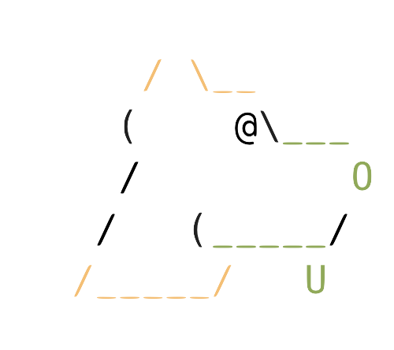

# cargo pup

<picture>
  <source media="(prefers-color-scheme: dark)" srcset="https://raw.githubusercontent.com/DataDog/cargo-pup/main/docs/pup_dark.png">
  <source media="(prefers-color-scheme: light)" srcset="https://raw.githubusercontent.com/DataDog/cargo-pup/main/docs/pup_light.png">
  
</picture>

**Pretty Useful Pup** (_pup_) lets you write assertions about your Rust project's architecture, letting you continuously
validate consistency both locally and in your CI pipelines. As projects grow and new contributors come on board inconsistency
begins to creep in, increasing the cognitive load for everyone working on the system.

Inspired by [ArchUnit](https://www.archunit.org/) and [ArchUnitNet](https://github.com/TNG/ArchUnitNET), it also 
introduces an exciting, fresh naming convention for architectural linting tools.

Check out the [Examples](#examples) to see what you can do!

## Installation

First, make sure to install [rustup](https://rustup.rs/) to manage your local rust installs and provide the tooling required for Pretty Useful Pup, if you haven't already.

Then install pup; **you must use this nightly toolchain, as pup depends on compiler internals that are otherwise unavailable!**
```bash
cargo +nightly-2025-05-31 install cargo_pup
```

## Getting Started

Now that we've installed pup, let's walk through using it on one of your projects. 

### Step 1: Explore Your Project Structure

Start by seeing what modules cargo pup can find in your project. 

```bash
cargo pup print-modules
```

The tree is grouped up by workspace module name and binary name, and the full path given is the path we can match on when we write our architecture rules. If we have rules targeting modules already, we can see them to the right of each - e.g. in the output of running `cargo pup` on pup itself, we see `empty_module_rule` targets all of our modules:

```bash
...

     / \__
    (    @\___
    /         O
   /   (_____/
  /_____/   U

Modules from multiple crates: cargo_pup_lint_config, cargo_pup_common, cargo_pup_lint_impl

cargo_pup_common
  ::cli [empty_mod_rule]
  ::project_context [empty_mod_rule]

cargo_pup_lint_config
  ::function_lint [empty_mod_rule]
  ::function_lint::builder [empty_mod_rule]
  ::function_lint::generate_config [empty_mod_rule]

...
```

### Step 2: Discover Available Traits

Similarly, we can see what traits our project contains, as well as `struct`s that implement them. 

```bash
cargo pup print-traits
```

For instance, running against pup itself we see the core lints as implementors of `ArchitectureLintRule`:

```bash
...

cargo_pup_lint_impl
  ::architecture_lint_rule::ArchitectureLintRule []
    → lints::struct_lint::struct_lint::StructLint
    → lints::module_lint::module_lint::ModuleLint
    → lints::function_lint::function_lint::FunctionLint

...
```

Constraining the implementations of traits can be useful - pup's own lints ensure that all `ArchitectureLintRule` implementors are marked `private` and must be named `.*LintProcessor`. 

### Step 3: Generate a Sample Configuration

To see how the architecture linting itself works, let's create a basic configuration to get started:

```bash
cargo pup generate-config
```

This creates a `pup.ron` file with example rules that you can examine and modify containing two basic rules:

* All `mod.rs` files must be empty of anything other than sub-module definitions and use statements
* Functions shouldn't be longer than 50 lines of code

These are just example rules that are likely to generate some lints for your project, and not at all _prescriptive guidance_! 

### Step 4: Run Your First Lint

With the configuration in place, run cargo pup:

```bash
cargo pup
```

You'll see pup analyze your code and report any violations based on the sample rules.

### Step 5: Create Custom Rules with the Builder

Now that you've seen how it works, you probably want to create serious, project-specific rules. Although you could go and edit the `pup.ron` directly, you'd have to do this with reference to pup's own internals and probably won't have a great time. 

Instead, you can use the builder interface, provided in the `cargo_pup_lint_config` package to write architectural assertions in Rust itself.

First, add the following to your `Cargo.toml`:

```toml
[dev-dependencies]
cargo_pup_lint_config = "0.1.1"
```

## Examples

Here's how to ensure that your API layer doesn't directly access database types:

```rust
use cargo_pup_lint_config::{LintBuilder, LintBuilderExt, ModuleLintExt, Severity};

// You likely want to add this as an integration-style test in `test`, not as a unit test.
#[test]
fn test_api_layer_isolation() {
    let mut builder = LintBuilder::new();
    
    // Ensure API controllers don't directly depend on database drivers
    builder.module_lint()
        .lint_named("api_no_direct_db_access")
        .matching(|m| m.module(".*::api::.*"))
        .with_severity(Severity::Error)
        .restrict_imports(
            None, 
            Some(vec![".*::database::*".to_string(), "sqlx::*".to_string()])
        )
        .build();
    
    // Test against current project - will panic if the rules are violated and print
    // the lint results to stderr. `assert_lints` will run a build of your project
    // with cargo_pup enabled!
    builder.assert_lints(None).expect("API isolation rules should pass");
}
```

You can also use the builder interface to generate a `pup.ron` configuration file and then run `cargo pup` on your project:

```rust
let mut builder = LintBuilder::new();
// ... configure your rules ...

// Write configuration to file
builder.write_to_file("pup.ron").expect("Failed to write config");

// Then run: cargo pup 
```

To see this in action, check out [test_app](test_app) which uses this style of configuration, and throws a heap of linting errors!

## How It Works 
cargo_pup uses `rustc`'s interface to bolt custom, dynamically defined lints into the compilation lifecycle. To do this, much like clippy and other tools that extend the compiler in this fashion, it has to compile your code using rust nightly. The output of this build is discrete from your regular build, and gets hidden in `.pup` within the project directory.

### UI Tests

Cargo Pup includes UI tests to validate lint behavior. These tests follow the pattern used by Clippy and other Rust compiler components.

To run the UI tests:

```bash
cargo test --test ui-test
```

If you make changes to the lints that affect the expected output, you can update the .stderr files with:

```bash
BLESS=1 cargo test --test ui-test
```

#### How UI Tests Work

UI tests consist of:
1. `.rs` files containing code that triggers (or doesn't trigger) lints 
2. `.stderr` files containing the expected compiler output/diagnostics

Tests use special comments:
- `//@` comments configure test behavior
- `//~` comments mark expected diagnostic locations

You can find examples in the `tests/ui/function_length/` directory.

## Pretty Useful Pup Tenets

* **Not [clippy](https://github.com/rust-lang/rust-clippy)** - pup isn't interested in code style and common-mistake style linting. We already have a great tool for this!
* **Simple to use** - pup should be easy to drop onto a developer's desktop or into a CI pipeline and work seamlessly as a `cargo` extension
* **Simple to configure** - in the spirit of similar static analysis tools, pup can read from `pup.ron` or be configured programmatically using the builder interface
