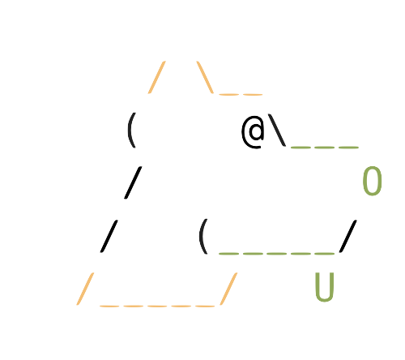

# `cargo pup`

<picture>
  <source media="(prefers-color-scheme: dark)" srcset="docs/pup_dark.png">
  <source media="(prefers-color-scheme: light)" srcset="docs/pup_light.png">
  
</picture>

**Pretty Useful Pup** (_pup_) lets you write assertions about your Rust project's architecture, letting you continuously
validate consistency both locally and in your CI pipelines. As projects grow and new contributors come on board inconsistency
begins to creep in, increasing the cognitive load for everyone working on the system.

Inspired by [ArchUnit](https://www.archunit.org/) and [ArchUnitNet](https://github.com/TNG/ArchUnitNET), it also 
introduces an exciting, fresh naming convention for architectural linting tools.

Check out the [Examples](#examples) to see what you can do!

## Installation

First, make sure to install [rustup](https://rustup.rs/) to manage your local rust installs and provide the tooling required for Pretty Useful Pup, if you haven't already.

Then install cargo-pup:
```bash
cargo install cargo-pup
```

## Getting Started

Cargo-pup can be run directly on your project like clippy with `cargo pup`, and reads a configuration file `pup.ron`. You have two options to generate this configuration:

1. **Generate a sample**: Run `cargo pup generate-config` to create an example config. This is not going to be tailored to capture the architecture rules of your project, but shows what the config looks like!
2. **Programmatic builder** (recommended): Using the builder interface in the `cargo-pup-lint-config` crate to either generate a `pup.ron`, or run the assertions directly, integration-test style

We encourage using the builder style as it provides better IDE support, type safety, and enables integration testing of your architectural rules.

## Examples

Here's how to enforce that your API layer doesn't directly access database types:

```rust
use cargo_pup_lint_config::{LintBuilder, LintBuilderExt, ModuleLintExt, Severity};

#[test]
fn test_api_layer_isolation() {
    let mut builder = LintBuilder::new();
    
    // Ensure API controllers don't directly depend on database drivers
    builder.module_lint()
        .lint_named("api_no_direct_db_access")
        .matching(|m| m.module(".*::api::.*"))
        .with_severity(Severity::Error)
        .restrict_imports(
            None, 
            Some(vec![".*::database::*".to_string(), "sqlx::*".to_string()])
        )
        .build();
    
    // Test against current project - will panic if the rules are violated and print
    // the lint results to stderr.
    builder.assert_lints(None).expect("API isolation rules should pass");
}
```

You can also use the builder interface to generate a `pup.ron` configuration file and then run `cargo pup` on your project:

```rust
let mut builder = LintBuilder::new();
// ... configure your rules ...

// Write configuration to file
builder.write_to_file("pup.ron").expect("Failed to write config");

// Then run: cargo pup 
```

## How It Works 
cargo-pup uses `rustc`'s interface to bolt custom, dynamically defined lints into the compilation lifecycle. To do this, much like clippy and other tools that extend the compiler in this fashion, it has to compile your code using rust nightly. The output of this build is discrete from your regular build, and gets hidden in `.pup` within the project directory.

### Working With the Code Base
TODO 

### UI Tests

Cargo Pup includes UI tests to validate lint behavior. These tests follow the pattern used by Clippy and other Rust compiler components.

To run the UI tests:

```bash
cargo test --test ui-test
```

If you make changes to the lints that affect the expected output, you can update the .stderr files with:

```bash
BLESS=1 cargo test --test ui-test
```

#### How UI Tests Work

UI tests consist of:
1. `.rs` files containing code that triggers (or doesn't trigger) lints 
2. `.stderr` files containing the expected compiler output/diagnostics

Tests use special comments:
- `//@` comments configure test behavior
- `//~` comments mark expected diagnostic locations
- `//@ pup-config: |` comments define lint configurations for the test

You can find examples in the `tests/ui/function_length/` directory.

## Pretty Useful Pup Tenets

* **Not [clippy](https://github.com/rust-lang/rust-clippy)** - pup isn't interested in code style and common-mistake style linting. We already have a great tool for this!
* **Simple to use** - pup should be easy to drop onto a developer's desktop or into a CI pipeline and work seamlessly as a `cargo` extension
* **Simple to configure** - in the spirit of similar static analysis tools, pup can read from `pup.ron` or be configured programmatically using the builder interface
* **Easy to integrate** - TODO - reference that standard for exporting linting syntax. 
